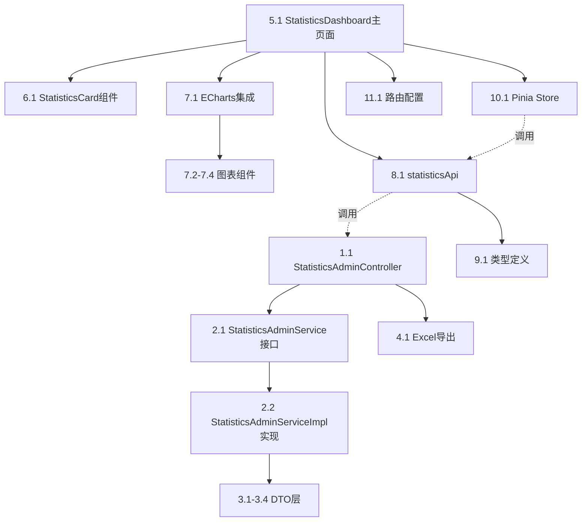

# 数据统计页面开发计划

## 功能概述
为管理端开发综合数据统计仪表板，展示充电桩使用率、收入统计、用户活跃度等核心业务指标。

## WBS 任务分解

### 后端开发 (12 任务点)

#### 1. 控制器层
- [ ] 1.1 创建 `StatisticsAdminController.java`
  - 定义统计数据查询接口
  - 支持时间范围筛选（今日/本周/本月/自定义）
  - 提供 Excel 导出接口

#### 2. 服务层
- [ ] 2.1 创建 `StatisticsAdminService.java` 接口
- [ ] 2.2 创建 `StatisticsAdminServiceImpl.java` 实现
  - 充电桩使用率统计
  - 收入统计（总收入、日均收入、月度趋势）
  - 用户活跃度统计（活跃用户数、新增用户数）
  - 充电记录统计（总次数、平均时长、电量消耗）

#### 3. DTO 层
- [ ] 3.1 创建 `StatisticsOverviewResponse.java` - 概览数据
- [ ] 3.2 创建 `ChargingPileUsageResponse.java` - 充电桩使用率
- [ ] 3.3 创建 `RevenueStatisticsResponse.java` - 收入统计
- [ ] 3.4 创建 `UserActivityResponse.java` - 用户活跃度

#### 4. 数据导出
- [ ] 4.1 实现 Excel 导出功能（使用 Apache POI）
  - 支持导出概览数据
  - 支持导出详细报表

### 前端开发 (14 任务点)

#### 5. 页面组件
- [ ] 5.1 创建 `StatisticsDashboard.vue` 主页面
  - 时间范围选择器（今日/本周/本月/自定义）
  - 数据刷新按钮
  - Excel 导出按钮

#### 6. 数据卡片组件
- [ ] 6.1 创建 `StatisticsCard.vue` 通用卡片组件
- [ ] 6.2 实现 8 个指标卡片：
  - 总收入
  - 日均收入
  - 充电桩总数
  - 在线充电桩数
  - 充电桩使用率
  - 活跃用户数
  - 新增用户数
  - 充电总次数

#### 7. 图表组件
- [ ] 7.1 集成 ECharts 库
- [ ] 7.2 创建收入趋势折线图
- [ ] 7.3 创建充电桩状态饼图
- [ ] 7.4 创建用户活跃度柱状图

#### 8. API 层
- [ ] 8.1 创建 `statisticsApi.ts`
  - `getStatisticsOverview()` - 获取概览数据
  - `getChargingPileUsage()` - 获取充电桩使用率
  - `getRevenueStatistics()` - 获取收入统计
  - `getUserActivity()` - 获取用户活跃度
  - `exportStatistics()` - 导出统计数据

#### 9. 类型定义
- [ ] 9.1 创建 `statistics.ts` 类型文件
  - 定义所有统计数据接口类型

#### 10. 状态管理
- [ ] 10.1 创建 `statistics.ts` Pinia Store
  - 管理统计数据状态
  - 缓存查询结果

#### 11. 路由配置
- [ ] 11.1 在 `router/index.ts` 添加统计页面路由
  - 路径：`/admin/statistics`
  - 权限：管理员

### 集成测试 (2 任务点)

#### 12. 测试验证
- [ ] 12.1 后端接口测试
  - 验证数据准确性
  - 验证时间范围筛选
  - 验证 Excel 导出
- [ ] 12.2 前端功能测试
  - 验证数据展示
  - 验证图表渲染
  - 验证响应式布局

## 依赖关系图

## 文件清单

### 后端新增文件 (8 个)
1. `backend/src/main/java/com/smartcharger/controller/StatisticsAdminController.java`
2. `backend/src/main/java/com/smartcharger/service/StatisticsAdminService.java`
3. `backend/src/main/java/com/smartcharger/service/impl/StatisticsAdminServiceImpl.java`
4. `backend/src/main/java/com/smartcharger/dto/response/StatisticsOverviewResponse.java`
5. `backend/src/main/java/com/smartcharger/dto/response/ChargingPileUsageResponse.java`
6. `backend/src/main/java/com/smartcharger/dto/response/RevenueStatisticsResponse.java`
7. `backend/src/main/java/com/smartcharger/dto/response/UserActivityResponse.java`
8. `backend/src/main/java/com/smartcharger/util/ExcelExportUtil.java`

### 前端新增文件 (7 个)
1. `frontend-admin/src/views/admin/StatisticsDashboard.vue`
2. `frontend-admin/src/components/StatisticsCard.vue`
3. `frontend-admin/src/api/statisticsApi.ts`
4. `frontend-admin/src/types/statistics.ts`
5. `frontend-admin/src/stores/statistics.ts`
6. `frontend-admin/src/components/charts/RevenueChart.vue`
7. `frontend-admin/src/components/charts/UserActivityChart.vue`

## 实施阶段

### Phase 1: 后端基础 (2-3 天)
- 完成控制器、服务层、DTO 层
- 实现核心统计逻辑

### Phase 2: 前端框架 (2-3 天)
- 完成主页面布局
- 实现数据卡片组件
- 集成 API 调用

### Phase 3: 数据可视化 (2-3 天)
- 集成 ECharts
- 实现各类图表
- 优化响应式布局

### Phase 4: 功能完善 (1 天)
- Excel 导出功能
- 集成测试
- 性能优化

## 验收标准

- ✅ 8 个核心指标卡片正常显示
- ✅ 3 个图表正常渲染（收入趋势、充电桩状态、用户活跃度）
- ✅ 时间范围筛选功能正常
- ✅ Excel 导出功能正常
- ✅ 数据刷新功能正常
- ✅ 响应式布局适配移动端
- ✅ 加载状态和错误处理完善
- ✅ 代码审查通过

## 技术要点

### 后端
- 使用 JPA 聚合查询优化性能
- Redis 缓存统计结果（5 分钟过期）
- Apache POI 生成 Excel 报表

### 前端
- ECharts 5.x 数据可视化
- Element Plus 数据展示组件
- Pinia 状态管理
- 响应式设计（Grid 布局）

---

**计划生成时间**: 2026-02-11
**预计工期**: 7-10 天
**优先级**: 高
