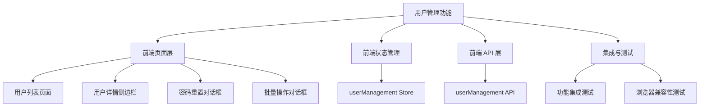
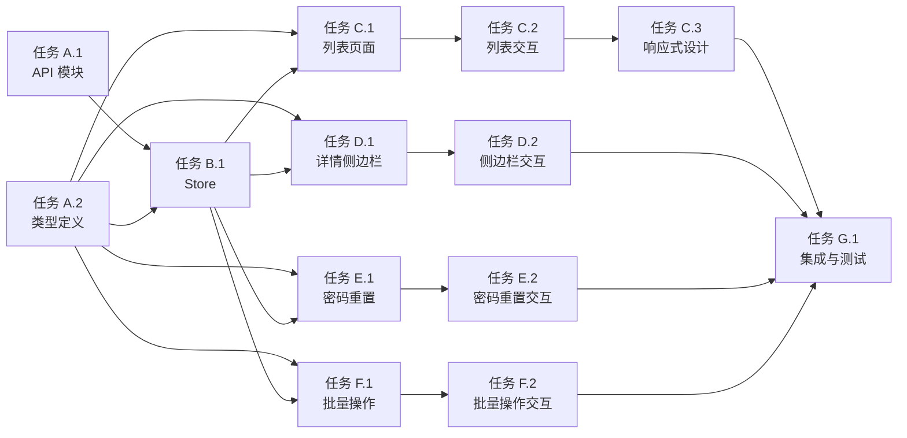

# 功能规划：用户管理功能（管理端）

**规划时间**：2026-02-11
**预估工作量**：18 任务点

---

## 1. 功能概述

### 1.1 目标
完善管理端用户管理页面，实现用户列表展示、状态管理（启用/禁用）、密码重置、批量操作、数据导出等功能，为系统管理员提供完整的用户运维能力。

### 1.2 范围

**包含**：
- 用户列表页面（搜索、筛选、分页）
- 用户详情侧边栏（基本信息、充电记录、预约记录、违规记录）
- 用户状态管理（启用/禁用、单个/批量）
- 密码重置对话框（生成临时密码、复制、发送）
- 批量操作对话框（批量启用/禁用、批量导出）
- 数据导出功能（Excel 格式）
- 响应式设计（桌面端表格 + 移动端卡片）

**不包含**：
- 用户创建功能（仅支持查看和管理）
- 权限分配功能（权限管理为独立功能）
- 用户删除功能（仅支持禁用）
- 短信/邮件发送（密码重置仅生成临时密码）

### 1.3 技术约束
- 前端框架：Vue 3 + TypeScript + Element Plus
- 状态管理：Pinia
- HTTP 客户端：Axios（已配置拦截器）
- 后端接口：已实现（UserManagementController）
- 兼容性：支持 Chrome、Firefox、Safari 最新版本
- 性能要求：列表加载 < 2s，详情加载 < 1s

---

## 2. WBS 任务分解

### 2.1 分解结构图

### 2.2 任务清单

#### 模块 A：前端 API 层（3 任务点）

**文件**: `frontend-admin/src/api/userManagement.ts`

- [ ] **任务 A.1**：创建用户管理 API 模块（2 点）
  - **输入**：后端接口规范（UserManagementController）
  - **输出**：完整的 API 调用函数集合
  - **关键步骤**：
    1. 创建 `userManagement.ts` 文件
    2. 实现 `getUserList()` - 获取用户列表（支持分页、搜索、筛选）
    3. 实现 `getUserDetail(id)` - 获取用户详情
    4. 实现 `updateUserStatus(id, request)` - 更新用户状态
    5. 实现 `resetPassword(id, request)` - 重置密码
    6. 实现 `getChargingRecords(userId)` - 获取用户充电记录
    7. 实现 `getReservations(userId)` - 获取用户预约记录
    8. 实现 `getViolations(userId)` - 获取用户违规记录
    9. 实现 `batchUpdateStatus(request)` - 批量更新用户状态
    10. 实现 `exportUsers(params)` - 导出用户数据

- [ ] **任务 A.2**：创建用户管理类型定义（1 点）
  - **输入**：后端 DTO 结构
  - **输出**：TypeScript 类型定义文件
  - **关键步骤**：
    1. 创建 `frontend-admin/src/types/userManagement.ts`
    2. 定义 `UserAdminResponse` 类型（用户基本信息）
    3. 定义 `UserDetailResponse` 类型（用户详情）
    4. 定义 `ChargingRecordInfo` 类型（充电记录）
    5. 定义 `ReservationInfo` 类型（预约记录）
    6. 定义 `ViolationInfo` 类型（违规记录）
    7. 定义 `PasswordResetResponse` 类型（密码重置响应）
    8. 定义查询参数类型（UserQueryParams、BatchStatusUpdateRequest）

#### 模块 B：前端状态管理（3 任务点）

**文件**: `frontend-admin/src/stores/userManagement.ts`

- [ ] **任务 B.1**：创建 Pinia Store（2 点）
  - **输入**：API 模块（任务 A.1）、类型定义（任务 A.2）
  - **输出**：完整的状态管理模块
  - **关键步骤**：
    1. 创建 `userManagement.ts` Store 文件
    2. 定义状态：users、currentUser、loading、total、currentPage、pageSize、selectedUserIds
    3. 实现 `fetchUserList(params)` - 获取用户列表
    4. 实现 `fetchUserDetail(id)` - 获取用户详情
    5. 实现 `updateUserStatus(id, request)` - 更新用户状态
    6. 实现 `resetPassword(id, request)` - 重置密码
    7. 实现 `fetchChargingRecords(userId)` - 获取充电记录
    8. 实现 `fetchReservations(userId)` - 获取预约记录
    9. 实现 `fetchViolations(userId)` - 获取违规记录
    10. 实现 `batchUpdateStatus(request)` - 批量更新状态
    11. 实现 `exportUsers(params)` - 导出用户数据
    12. 实现 `clearCurrentUser()` - 清空当前用户
    13. 实现 `resetPagination()` - 重置分页

- [ ] **任务 B.2**：错误处理与加载状态管理（1 点）
  - **输入**：Store 基础结构（任务 B.1）
  - **输出**：完善的错误处理机制
  - **关键步骤**：
    1. 在所有 action 中添加 try-catch 块
    2. 统一错误消息提示（ElMessage.error）
    3. 区分网络错误、业务错误、权限错误
    4. 添加加载状态管理（loading 标志）
    5. 实现错误重试机制

#### 模块 C：前端页面层 - 列表页面（4 任务点）

**文件**: `frontend-admin/src/views/admin/UserManagementList.vue`

- [ ] **任务 C.1**：创建用户列表页面框架（2 点）
  - **输入**：Store（任务 B.1）、API（任务 A.1）
  - **输出**：完整的列表页面组件
  - **关键步骤**：
    1. 创建 `UserManagementList.vue` 组件
    2. 实现页面布局：卡片容器 + 筛选条件 + 表格/卡片 + 分页
    3. 实现筛选表单（用户名、邮箱、状态、注册日期范围）
    4. 实现表格列定义：ID、用户名、邮箱、手机、真实姓名、状态、注册时间、操作
    5. 实现表格行操作按钮：查看详情、启用/禁用、重置密码、删除（禁用）
    6. 实现分页组件（支持自定义页码、页大小）
    7. 实现骨架屏加载状态
    8. 实现错误状态显示与重试按钮

- [ ] **任务 C.2**：实现列表交互功能（1 点）
  - **输入**：列表页面框架（任务 C.1）
  - **输出**：完整的交互逻辑
  - **关键步骤**：
    1. 实现搜索功能（用户名、邮箱关键词搜索）
    2. 实现筛选功能（状态、日期范围）
    3. 实现分页切换（页码、页大小改变）
    4. 实现表格排序（按注册时间、用户名）
    5. 实现行选择（复选框、全选/反选）
    6. 实现批量操作按钮显示/隐藏

- [ ] **任务 C.3**：实现响应式设计（1 点）
  - **输入**：列表页面（任务 C.1、C.2）
  - **输出**：支持桌面端和移动端的页面
  - **关键步骤**：
    1. 添加窗口大小监听（resize 事件）
    2. 实现桌面端表格视图（完整表格）
    3. 实现移动端卡片视图（简化卡片布局）
    4. 实现响应式样式（媒体查询）
    5. 测试不同屏幕尺寸的显示效果

#### 模块 D：前端页面层 - 详情侧边栏（3 任务点）

**文件**: `frontend-admin/src/components/UserDetailDrawer.vue`

- [ ] **任务 D.1**：创建用户详情侧边栏组件（2 点）
  - **输入**：Store（任务 B.1）、类型定义（任务 A.2）
  - **输出**：完整的详情侧边栏组件
  - **关键步骤**：
    1. 创建 `UserDetailDrawer.vue` 组件
    2. 实现侧边栏布局：标签页 + 内容区域
    3. 实现"基本信息"标签页：用户ID、用户名、邮箱、手机、真实姓名、状态、注册时间、最后登录时间
    4. 实现"充电记录"标签页：充电记录列表（表格形式，显示充电桩、时间、电量、费用）
    5. 实现"预约记录"标签页：预约列表（表格形式，显示充电桩、预约时间、状态）
    6. 实现"违规记录"标签页：违规列表（表格形式，显示违规类型、时间、描述）
    7. 实现加载状态（骨架屏）
    8. 实现错误状态显示

- [ ] **任务 D.2**：实现侧边栏交互与数据加载（1 点）
  - **输入**：侧边栏组件（任务 D.1）
  - **输出**：完整的交互逻辑
  - **关键步骤**：
    1. 实现打开/关闭侧边栏逻辑
    2. 实现用户详情数据加载
    3. 实现标签页切换时加载对应数据
    4. 实现数据刷新功能
    5. 实现关闭侧边栏时清空数据

#### 模块 E：前端页面层 - 密码重置对话框（2 任务点）

**文件**: `frontend-admin/src/components/PasswordResetDialog.vue`

- [ ] **任务 E.1**：创建密码重置对话框组件（1 点）
  - **输入**：Store（任务 B.1）、类型定义（任务 A.2）
  - **输出**：完整的密码重置对话框
  - **关键步骤**：
    1. 创建 `PasswordResetDialog.vue` 组件
    2. 实现对话框布局：标题 + 内容 + 操作按钮
    3. 实现用户信息显示（用户名、邮箱）
    4. 实现临时密码显示区域（只读输入框）
    5. 实现"复制密码"按钮（使用 clipboard API）
    6. 实现"发送邮件"按钮（调用后端接口）
    7. 实现加载状态与禁用状态

- [ ] **任务 E.2**：实现密码重置交互逻辑（1 点）
  - **输入**：对话框组件（任务 E.1）
  - **输出**：完整的交互逻辑
  - **关键步骤**：
    1. 实现打开/关闭对话框逻辑
    2. 实现调用重置密码 API
    3. 实现复制密码到剪贴板
    4. 实现发送邮件通知
    5. 实现成功/失败提示
    6. 实现关闭对话框时清空数据

#### 模块 F：前端页面层 - 批量操作对话框（2 任务点）

**文件**: `frontend-admin/src/components/BatchStatusDialog.vue`

- [ ] **任务 F.1**：创建批量操作对话框组件（1 点）
  - **输入**：Store（任务 B.1）、类型定义（任务 A.2）
  - **输出**：完整的批量操作对话框
  - **关键步骤**：
    1. 创建 `BatchStatusDialog.vue` 组件
    2. 实现对话框布局：标题 + 内容 + 操作按钮
    3. 实现选中用户列表显示（用户名、邮箱）
    4. 实现操作类型选择（启用/禁用）
    5. 实现确认提示信息
    6. 实现加载状态与禁用状态

- [ ] **任务 F.2**：实现批量操作交互逻辑（1 点）
  - **输入**：对话框组件（任务 F.1）
  - **输出**：完整的交互逻辑
  - **关键步骤**：
    1. 实现打开/关闭对话框逻辑
    2. 实现调用批量更新 API
    3. 实现操作成功后刷新列表
    4. 实现成功/失败提示
    5. 实现关闭对话框时清空选中状态

#### 模块 G：集成与测试（1 任务点）

**文件**: `frontend-admin/src/views/admin/UserManagementList.vue`（集成）

- [ ] **任务 G.1**：功能集成与测试（1 点）
  - **输入**：所有页面组件（任务 C、D、E、F）
  - **输出**：完整可用的用户管理功能
  - **关键步骤**：
    1. 在列表页面中集成所有子组件（侧边栏、对话框）
    2. 实现组件间通信（事件、Prop）
    3. 测试列表加载、搜索、筛选、分页
    4. 测试详情侧边栏打开/关闭、标签页切换
    5. 测试密码重置流程
    6. 测试批量操作流程
    7. 测试数据导出功能
    8. 测试错误处理与重试
    9. 测试响应式设计（桌面端、平板、手机）
    10. 测试浏览器兼容性（Chrome、Firefox、Safari）

---

## 3. 依赖关系

### 3.1 依赖图

### 3.2 依赖说明

| 任务 | 依赖于 | 原因 |
|------|--------|------|
| B.1 (Store) | A.1, A.2 | Store 需要调用 API 和使用类型定义 |
| C.1 (列表页面) | A.2, B.1 | 页面需要类型定义和 Store 状态 |
| C.2 (列表交互) | C.1 | 交互逻辑基于列表页面框架 |
| C.3 (响应式设计) | C.2 | 响应式设计需要完整的列表功能 |
| D.1 (详情侧边栏) | A.2, B.1 | 侧边栏需要类型定义和 Store 状态 |
| D.2 (侧边栏交互) | D.1 | 交互逻辑基于侧边栏框架 |
| E.1 (密码重置) | A.2, B.1 | 对话框需要类型定义和 Store 状态 |
| E.2 (密码重置交互) | E.1 | 交互逻辑基于对话框框架 |
| F.1 (批量操作) | A.2, B.1 | 对话框需要类型定义和 Store 状态 |
| F.2 (批量操作交互) | F.1 | 交互逻辑基于对话框框架 |
| G.1 (集成测试) | C.3, D.2, E.2, F.2 | 集成测试需要所有功能完成 |

### 3.3 并行任务

以下任务可以并行开发：
- 任务 A.1 ∥ 任务 A.2（API 和类型定义独立）
- 任务 C.1 ∥ 任务 D.1 ∥ 任务 E.1 ∥ 任务 F.1（各页面组件独立，仅依赖 A.2 和 B.1）
- 任务 C.2 ∥ 任务 D.2 ∥ 任务 E.2 ∥ 任务 F.2（各交互逻辑独立）

---

## 4. 实施建议

### 4.1 技术选型

| 需求 | 推荐方案 | 理由 |
|------|----------|------|
| 列表加载状态 | Element Plus Skeleton | 与现有 UI 框架一致，用户体验好 |
| 侧边栏 | Element Plus Drawer | 标准组件，支持响应式 |
| 对话框 | Element Plus Dialog | 标准组件，交互清晰 |
| 表格 | Element Plus Table | 功能完整，支持排序、筛选 |
| 复制到剪贴板 | Clipboard API / vue-clipboard3 | 原生 API 足够，无需额外依赖 |
| 日期选择 | Element Plus DatePicker | 与现有框架一致 |
| 消息提示 | Element Plus Message | 与现有框架一致 |

### 4.2 潜在风险

| 风险 | 影响 | 缓解措施 |
|------|------|----------|
| 大数据量列表性能下降 | 中 | 实现虚拟滚动、分页限制（最多 100 条/页）、后端数据库索引优化 |
| 并发更新用户状态冲突 | 中 | 后端已实现乐观锁，前端添加操作防抖 |
| 密码重置邮件发送失败 | 低 | 前端仅生成临时密码，邮件发送由后端处理，失败时显示错误提示 |
| 浏览器兼容性问题 | 低 | 使用 Polyfill（如 clipboard-polyfill），测试主流浏览器 |
| 移动端表单输入体验差 | 低 | 使用 Element Plus 响应式组件，测试移动设备 |

### 4.3 测试策略

- **单元测试**：为 Store actions 编写测试（Vitest）
  - 测试 API 调用成功/失败场景
  - 测试状态更新逻辑
  - 测试错误处理

- **集成测试**：测试完整的用户流程
  - 列表加载 → 搜索筛选 → 查看详情 → 重置密码 → 批量操作
  - 测试组件间通信
  - 测试数据一致性

- **E2E 测试**：使用 Playwright/Cypress 测试完整流程
  - 用户登录 → 进入用户管理 → 执行各项操作 → 验证结果

- **性能测试**：
  - 列表加载时间 < 2s
  - 详情加载时间 < 1s
  - 批量操作响应时间 < 3s

- **兼容性测试**：
  - Chrome 最新版本
  - Firefox 最新版本
  - Safari 最新版本
  - Edge 最新版本

---

## 5. 验收标准

功能完成需满足以下条件：

- [ ] 所有任务清单完成
- [ ] 用户列表页面正常加载，支持搜索、筛选、分页
- [ ] 用户详情侧边栏可正常打开/关闭，显示完整信息
- [ ] 密码重置功能可正常使用，临时密码可复制
- [ ] 批量操作功能可正常使用，支持批量启用/禁用
- [ ] 数据导出功能可正常使用，导出 Excel 格式
- [ ] 响应式设计正常，桌面端和移动端显示正确
- [ ] 错误处理完善，异常情况有明确提示
- [ ] 代码审查通过（代码规范、类型安全、注释完整）
- [ ] 单元测试覆盖率 ≥ 80%
- [ ] 无高优先级 Bug
- [ ] 浏览器兼容性测试通过

---

## 6. 后续优化方向（可选）

Phase 2 可考虑的增强：

- **权限管理**：为用户分配/修改角色和权限
- **用户创建**：支持管理员创建新用户
- **用户删除**：支持永久删除用户（需谨慎）
- **操作日志**：记录管理员的所有操作
- **数据统计**：用户活跃度、充电消费统计
- **高级搜索**：支持多条件组合搜索、保存搜索条件
- **用户分组**：按地区、消费等级分组管理
- **短信通知**：支持短信发送临时密码
- **用户导入**：支持批量导入用户数据
- **审计日志**：记录用户管理的所有变更

---

## 7. 文件创建清单

### 新建文件

| 文件路径 | 文件类型 | 优先级 | 说明 |
|---------|---------|--------|------|
| `frontend-admin/src/api/userManagement.ts` | TypeScript | P0 | 用户管理 API 模块 |
| `frontend-admin/src/types/userManagement.ts` | TypeScript | P0 | 用户管理类型定义 |
| `frontend-admin/src/stores/userManagement.ts` | TypeScript | P0 | 用户管理 Pinia Store |
| `frontend-admin/src/views/admin/UserManagementList.vue` | Vue 3 | P0 | 用户列表页面 |
| `frontend-admin/src/components/UserDetailDrawer.vue` | Vue 3 | P0 | 用户详情侧边栏 |
| `frontend-admin/src/components/PasswordResetDialog.vue` | Vue 3 | P0 | 密码重置对话框 |
| `frontend-admin/src/components/BatchStatusDialog.vue` | Vue 3 | P0 | 批量操作对话框 |

### 修改文件

| 文件路径 | 修改内容 | 优先级 |
|---------|---------|--------|
| `frontend-admin/src/router/index.ts` | 添加用户管理路由 | P0 |
| `frontend-admin/src/App.vue` | 添加用户管理菜单项 | P0 |

---

## 8. 实施步骤（按优先级排序）

### 第一阶段：基础设施（1-2 天）
1. 任务 A.1：创建 API 模块
2. 任务 A.2：创建类型定义
3. 任务 B.1：创建 Pinia Store
4. 任务 B.2：完善错误处理

### 第二阶段：页面开发（2-3 天）
5. 任务 C.1：创建列表页面框架
6. 任务 D.1：创建详情侧边栏
7. 任务 E.1：创建密码重置对话框
8. 任务 F.1：创建批量操作对话框

### 第三阶段：交互实现（1-2 天）
9. 任务 C.2：实现列表交互
10. 任务 C.3：实现响应式设计
11. 任务 D.2：实现侧边栏交互
12. 任务 E.2：实现密码重置交互
13. 任务 F.2：实现批量操作交互

### 第四阶段：集成测试（1 天）
14. 任务 G.1：功能集成与测试

---

**文档生成时间**：2026-02-11
**预估总工作量**：18 任务点（约 18-36 小时）
**建议团队规模**：1-2 名前端开发者
**预计完成周期**：5-7 个工作日
