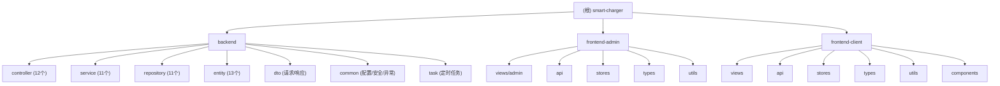

# Smart Charger 智能充电桩管理系统

## 变更记录 (Changelog)

### 2026-02-01 17:23:13
- 初始化项目 AI 上下文索引
- 完成三模块架构扫描（backend、frontend-admin、frontend-client）
- 识别核心实体、控制器、服务层结构
- 生成模块级文档与覆盖率报告

---

## 项目愿景

Smart Charger 是一个全栈智能充电桩管理系统，旨在为电动汽车用户提供便捷的充电桩查询、预约、充电记录管理等服务，同时为管理员提供充电桩运维、费用配置、公告管理等后台管理功能。

**核心价值**：
- 用户端：实时查询充电桩状态、在线预约、费用估算、充电记录统计
- 管理端：充电桩运维管理、价格策略配置、系统公告发布、故障报修处理
- 技术特性：前后端分离、JWT 认证、Redis 缓存、分布式锁、定时任务

---

## 架构总览

### 技术栈
- **后端**：Spring Boot 3.2.2 + Spring Data JPA + MySQL + Redis + Redisson
- **前端（用户端）**：Vue 3 + TypeScript + Element Plus + Pinia + Vite
- **前端（管理端）**：Vue 3 + TypeScript + Element Plus + Pinia + Vite
- **安全**：Spring Security + JWT (jjwt 0.12.3)
- **工具库**：Hutool、Lombok、Apache POI

### 系统架构
```
┌─────────────────────────────────────────────────────────┐
│                    前端层 (Frontend)                     │
├──────────────────────┬──────────────────────────────────┤
│  frontend-client     │     frontend-admin               │
│  (用户端)             │     (管理端)                      │
│  - 充电桩查询         │     - 费用配置管理                │
│  - 预约管理           │     - 公告管理                    │
│  - 车辆管理           │     - 用户管理                    │
│  - 充电记录           │     - 数据统计                    │
└──────────────────────┴──────────────────────────────────┘
                          ↓ HTTP/REST API
┌─────────────────────────────────────────────────────────┐
│                    后端层 (Backend)                      │
│  Spring Boot Application (Port: 8080, Context: /api)   │
├─────────────────────────────────────────────────────────┤
│  Controller 层 (12个控制器)                              │
│  - AuthController, ChargingPileController               │
│  - ReservationController, VehicleController             │
│  - ChargingRecordController, PriceConfigController      │
│  - AnnouncementController, FaultReportController        │
│  - WarningNoticeController, UserManagementController    │
├─────────────────────────────────────────────────────────┤
│  Service 层 (11个服务 + 实现类)                          │
│  - 业务逻辑处理、事务管理、缓存策略                       │
├─────────────────────────────────────────────────────────┤
│  Repository 层 (11个仓储接口)                            │
│  - Spring Data JPA 数据访问                             │
├─────────────────────────────────────────────────────────┤
│  Entity 层 (13个实体 + 8个枚举)                          │
│  - User, Role, Permission, ChargingPile                 │
│  - Reservation, ChargingRecord, Vehicle                 │
│  - PriceConfig, Announcement, FaultReport               │
│  - WarningNotice, SystemConfig                          │
└─────────────────────────────────────────────────────────┘
                          ↓
┌─────────────────────────────────────────────────────────┐
│                  数据层 (Data Layer)                     │
├──────────────────────┬──────────────────────────────────┤
│  MySQL Database      │     Redis Cache                  │
│  - 持久化存储         │     - 会话缓存                    │
│  - JPA 自动建表       │     - 分布式锁 (Redisson)         │
└──────────────────────┴──────────────────────────────────┘
```

---

## 模块结构图



---

## 模块索引

| 模块路径 | 职责 | 技术栈 | 入口文件 | 状态 |
|---------|------|--------|---------|------|
| [backend](./backend/CLAUDE.md) | 后端 API 服务，提供 RESTful 接口 | Spring Boot 3.2.2 + JPA + MySQL + Redis | `SmartChargerApplication.java` | 运行中 |
| [frontend-admin](./frontend-admin/CLAUDE.md) | 管理端前端，费用配置、公告管理 | Vue 3 + TypeScript + Element Plus | `src/main.ts` | 开发中 |
| [frontend-client](./frontend-client/CLAUDE.md) | 用户端前端，充电桩查询、预约、充电记录 | Vue 3 + TypeScript + Element Plus | `src/main.ts` | 开发中 |

---

## 运行与开发

### 后端启动
```bash
cd backend
mvn spring-boot:run
# 或使用 IDE 运行 SmartChargerApplication.java
# 访问：http://localhost:8080/api
```

**前置条件**：
- JDK 17+
- MySQL 8.0+ (数据库名：smart_charger)
- Redis 6.0+

### 前端启动（用户端）
```bash
cd frontend-client
npm install
npm run dev
# 访问：http://localhost:5173
```

### 前端启动（管理端）
```bash
cd frontend-admin
npm install
npm run dev
# 访问：http://localhost:5174
```

**前置条件**：
- Node.js 20.19.0+ 或 22.12.0+

---

## 测试策略

### 后端测试
- **单元测试**：未发现测试目录（建议补充）
- **集成测试**：未配置
- **API 测试**：可使用 Postman/Insomnia 测试 REST 接口

### 前端测试
- **单元测试**：Vitest + Vue Test Utils
  - `frontend-admin/src/components/__tests__/HelloWorld.spec.ts`
  - `frontend-client/src/components/__tests__/HelloWorld.spec.ts`
- **运行测试**：`npm run test:unit`

**覆盖率缺口**：
- 后端缺少完整的单元测试和集成测试
- 前端仅有示例测试，业务组件测试覆盖不足

---

## 编码规范

### 后端规范
- **包结构**：按功能分层（controller、service、repository、entity、dto、common）
- **命名约定**：
  - 实体类：名词单数（User、ChargingPile）
  - 服务接口：XxxService，实现类：XxxServiceImpl
  - 控制器：XxxController
  - DTO：XxxRequest/XxxResponse
- **注解使用**：
  - `@RestController` + `@RequestMapping` 定义 API 路由
  - `@Service` + `@Transactional` 管理事务
  - `@Repository` 标记数据访问层
  - `@Entity` + `@Table` 映射数据库表
- **异常处理**：统一通过 `GlobalExceptionHandler` 处理
- **返回格式**：统一使用 `Result<T>` 包装响应

### 前端规范
- **目录结构**：
  - `views/`：页面组件
  - `components/`：可复用组件
  - `api/`：API 请求封装
  - `stores/`：Pinia 状态管理
  - `types/`：TypeScript 类型定义
  - `utils/`：工具函数（auth、request）
- **命名约定**：
  - 组件：PascalCase（UserList.vue）
  - 文件：camelCase（userApi.ts）
  - 常量：UPPER_SNAKE_CASE
- **状态管理**：使用 Pinia defineStore
- **路由守卫**：统一在 `router/index.ts` 中配置认证检查

---

## AI 使用指引

### 快速定位代码
- **查找实体定义**：`backend/src/main/java/com/smartcharger/entity/`
- **查找 API 接口**：`backend/src/main/java/com/smartcharger/controller/`
- **查找业务逻辑**：`backend/src/main/java/com/smartcharger/service/impl/`
- **查找前端页面**：`frontend-{client|admin}/src/views/`
- **查找 API 调用**：`frontend-{client|admin}/src/api/`

### 常见任务
1. **新增实体**：
   - 创建 Entity → Repository → Service → Controller → DTO
   - 前端：创建 Type → API → Store → View
2. **修改接口**：
   - 后端：修改 Controller 方法签名 → 更新 Service 实现
   - 前端：同步更新 API 调用和类型定义
3. **调试问题**：
   - 后端日志：查看控制台输出（DEBUG 级别）
   - 前端调试：浏览器 DevTools + Vue DevTools

### 关键配置文件
- **后端配置**：`backend/src/main/resources/application.properties`
- **前端配置**：`frontend-{client|admin}/vite.config.ts`
- **依赖管理**：`backend/pom.xml`、`frontend-{client|admin}/package.json`

---

## 附录：核心实体关系

```
User (用户)
  ├─ Role (角色) [多对多]
  ├─ Vehicle (车辆) [一对多]
  ├─ Reservation (预约) [一对多]
  ├─ ChargingRecord (充电记录) [一对多]
  └─ FaultReport (故障报修) [一对多]

ChargingPile (充电桩)
  ├─ Reservation (预约) [一对多]
  ├─ ChargingRecord (充电记录) [一对多]
  └─ FaultReport (故障报修) [一对多]

PriceConfig (价格配置)
  └─ ChargingRecord (充电记录) [一对多]

Announcement (公告)
  └─ 独立实体

WarningNotice (预警通知)
  └─ User (用户) [多对一]

SystemConfig (系统配置)
  └─ 全局配置存储
```

---

**文档生成时间**：2026-02-01 17:23:13
**扫描覆盖率**：见 `.claude/index.json`
**下一步建议**：查看各模块详细文档，补充单元测试
